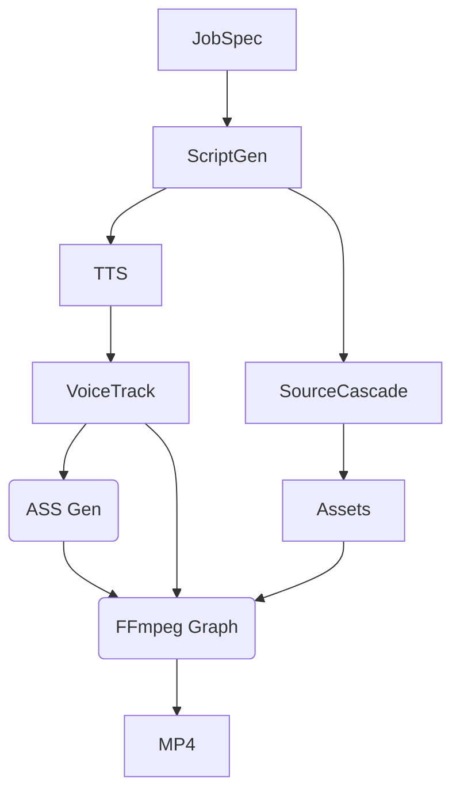

# Faceless Shorts Generator 🎬

A production-quality Python CLI and Gradio Web UI for generating 9:16 vertical short-form videos with AI scripts, TTS voiceovers, karaoke captions, Ken Burns pan/zoom, and dynamic overlays.

## Features
- **100% Free-Tier Architecture**: Runs natively using API keyless providers (Wikimedia, Openverse, edge-tts, Pollinations). Optional support for premium API keys.
- **Flawless FFmpeg Graphs**: Renders entirely via a single `-filter_complex` graph meaning zero intermediate IO overhead and no zoompan jitter.
- **Concurrent Pipeline**: Orchestrates Image Fetching and TTS simultaneously via `asyncio`.
- **Reproducible Renders**: Outputs a `.json` sidecar alongside every `.mp4`.
- **Gradio 5 UI**: Full-fledged control center to iterate on scripts, tone, overlays, and circuit-breaker health.

## Quickstart
```bash
pip install -e .
python app.py
```
Or use the CLI:
```bash
shorts generate "The Roman Empire" --tone documentary --duration 30
```

## Free-Key Providers
| Provider | Role | Free Limits | Setup Command |
|----------|------|-------------|---------------|
| edge-tts | Voice | Unlimited (Keyless) | - |
| Groq | Script LLM | Generous | `shorts keys --setup` |
| Cerebras | Script LLM | Unlimited Beta | `shorts keys --setup` |
| Gemini Flash | Script LLM | 1500 req / day | `shorts keys --setup` |
| Openverse | Images | Anon (Keyless) | - |
| Wikimedia | Images | Anon (Keyless) | - |
| Pollinations | Fallback Image | Anon (Keyless) | - |

## Architecture


## Troubleshooting
1. **FFmpeg missing**: Run `shorts doctor` to diagnose. Install via `brew install ffmpeg` or `apt install ffmpeg`.
2. **Audio Sync drift**: Our `\k` generation logic relies on word-level timestamps. Ensure `edge-tts` hasn't rate-limited the `WordBoundary` events.
3. **No images found**: Check `shorts sources --health` to see if a circuit breaker is currently OPEN due to cascading API failures.
4. **Gradio UI slow**: FFmpeg pins the CPU heavily. The Render queue concurrency is intentionally restricted to 1.
5. **Zoompan jitter**: Ensure your source images are appropriately high-res. The generator auto-scales 2x before zoompan to explicitly eliminate FFmpeg's low-res interpolation jitter artifact.
